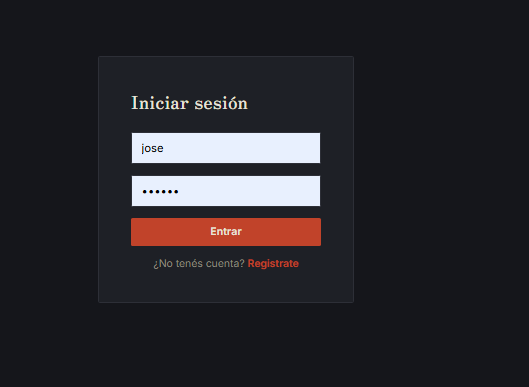
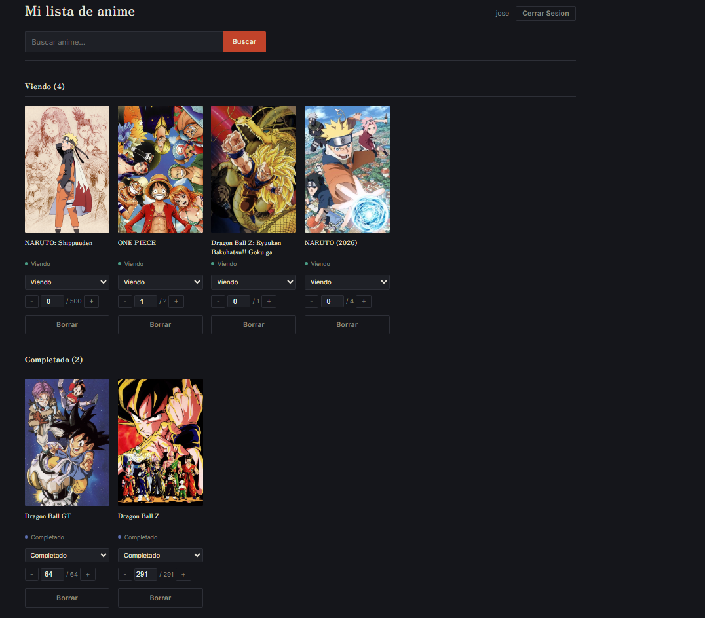
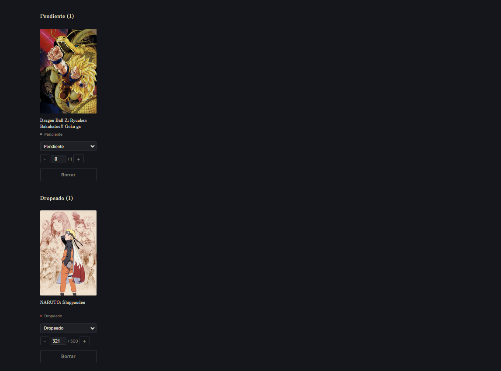

# Anime Tracker

Aplicación web full-stack para llevar el registro de los animes que estás viendo, querés ver, completaste o abandonaste. Cada usuario crea su cuenta y arma su propia lista, buscando títulos reales a través de la API de AniList.

**Demo en vivo:** https://anime-tracker-two-xi.vercel.app

> La primera carga puede tardar hasta un minuto. El backend corre en el plan gratuito de Render, que pone el servidor en reposo tras unos minutos sin uso, y se despierta con el primer pedido.

## Capturas

| Login | Mi lista |
|---|---|
|  |  |  

## Funcionalidades

- Registro e inicio de sesión de usuarios, con sesión persistente
- Búsqueda de animes en AniList y agregado a la lista personal con un click
- Lista agrupada por estado: Viendo, Pendiente, Completado y Dropeado
- Cambio de estado y de episodio actual (con botones o escribiendo el número directamente)
- Eliminación de títulos de la lista
- Cada usuario ve y modifica únicamente sus propios datos
- Prevención de duplicados en la lista, garantizada desde la base de datos

## Stack

| Capa | Tecnología |
|---|---|
| Frontend | React (Vite), CSS propio |
| Backend | Node.js, Express |
| Base de datos | PostgreSQL |
| Autenticación | JWT, bcrypt |
| API externa | AniList (GraphQL) |
| Deploy | Vercel (frontend), Render (backend), Neon (base de datos) |

## Arquitectura

```
Navegador  →  Frontend (React, Vercel)
                  │
                  ▼
              API REST (Express, Render)  →  AniList (búsqueda de animes)
                  │
                  ▼
              PostgreSQL (Neon)
```

## Endpoints de la API

| Método | Ruta | Descripción | Requiere token |
|---|---|---|---|
| POST | `/auth/registro` | Crea una cuenta | No |
| POST | `/auth/login` | Devuelve un JWT | No |
| GET | `/anime/buscar?nombre=` | Busca animes en AniList | No |
| GET | `/mi-lista` | Lista del usuario autenticado | Sí |
| POST | `/mi-lista` | Agrega un anime a la lista | Sí |
| PATCH | `/mi-lista/:id` | Actualiza estado, episodio o rating | Sí |
| DELETE | `/mi-lista/:id` | Elimina un anime de la lista | Sí |

## Decisiones técnicas

**Contraseñas con hash.** Las contraseñas nunca se guardan en texto plano: se hashean con bcrypt antes de insertarlas. Los mensajes de error del login son genéricos ("usuario o contraseña incorrectos") para no revelar qué usuarios existen.

**Protección contra IDOR.** Cada consulta sobre `mi_lista` filtra por el `usuario_id` que sale del token, no por datos que mande el cliente. Un usuario autenticado no puede editar ni borrar registros de otro adivinando un `id`.

**Consultas parametrizadas.** Todas las queries usan placeholders (`$1`, `$2`...) en lugar de concatenar strings, para evitar inyección SQL.

**Duplicados resueltos en la base de datos.** Una restricción `UNIQUE (anime_id, usuario_id)` impide repetir un anime en la lista de un mismo usuario, pero permite que distintos usuarios tengan el mismo título. El backend traduce el error de Postgres a un `409 Conflict`.

**Cambio de Jikan a AniList.** El proyecto arrancó consumiendo la API de Jikan, pero devolvía errores 504 de forma persistente desde mi red. Aislé el problema probando el mismo pedido desde el navegador, desde un script de Node suelto y contra otra API, confirmé que no era un problema del código, y migré a AniList.

**Configuración por variables de entorno.** Credenciales, secretos, URL de la API y orígenes permitidos por CORS viven en variables de entorno, nunca en el repositorio.

## Correrlo en local

Requisitos: Node.js 20+ y PostgreSQL.

### 1. Base de datos

Creá una base de datos (por ejemplo `anime_tracker`) y ejecutá:

```sql
CREATE TABLE animes (
    id SERIAL PRIMARY KEY,
    anilist_id INTEGER UNIQUE NOT NULL,
    titulo VARCHAR(255) NOT NULL,
    imagen TEXT,
    episodios INTEGER,
    sinopsis TEXT
);

CREATE TABLE usuarios (
    id SERIAL PRIMARY KEY,
    nombre_usuario VARCHAR(50) UNIQUE NOT NULL,
    email VARCHAR(255) UNIQUE NOT NULL,
    password_hash TEXT NOT NULL,
    fecha_registro TIMESTAMP DEFAULT NOW()
);

CREATE TABLE mi_lista (
    id SERIAL PRIMARY KEY,
    anime_id INTEGER NOT NULL REFERENCES animes(id) ON DELETE CASCADE,
    estado VARCHAR(20) NOT NULL DEFAULT 'plan_to_watch',
    episodio_actual INTEGER DEFAULT 0,
    mi_rating INTEGER,
    fecha_actualizacion TIMESTAMP DEFAULT NOW(),
    usuario_id INTEGER REFERENCES usuarios(id) ON DELETE CASCADE,
    CONSTRAINT mi_lista_anime_usuario_unico UNIQUE (anime_id, usuario_id)
);
```

### 2. Backend

En la raíz del proyecto, creá un archivo `.env`:

```
DB_USER=postgres
DB_HOST=localhost
DB_NAME=anime_tracker
DB_PASSWORD=tu_contraseña
DB_PORT=5432
DB_SSL=false
JWT_SECRET=una_clave_larga_y_aleatoria
```

Instalá las dependencias y levantá el servidor:

```bash
npm install
node index.js
```

La API queda en `http://localhost:3000`.

### 3. Frontend

```bash
cd frontend
npm install
```

Creá `frontend/.env`:

```
VITE_API_URL=http://localhost:3000
```

Y levantalo:

```bash
npm run dev
```

La app queda en `http://localhost:5173`.

## Variables de entorno en producción

| Servicio | Variables |
|---|---|
| Render (backend) | `DB_USER`, `DB_HOST`, `DB_NAME`, `DB_PASSWORD`, `DB_PORT`, `DB_SSL=true`, `JWT_SECRET`, `FRONTEND_URL` |
| Vercel (frontend) | `VITE_API_URL` |

## Posibles mejoras

- Calificación (rating) editable desde la interfaz
- Filtros y ordenamiento dentro de cada sección
- Tests automáticos del backend
- Paginación de resultados de búsqueda

## Autor

Agustín Pérez Barrionuevo, [GitHub](https://github.com/AgustinPereezBarrionuevo)